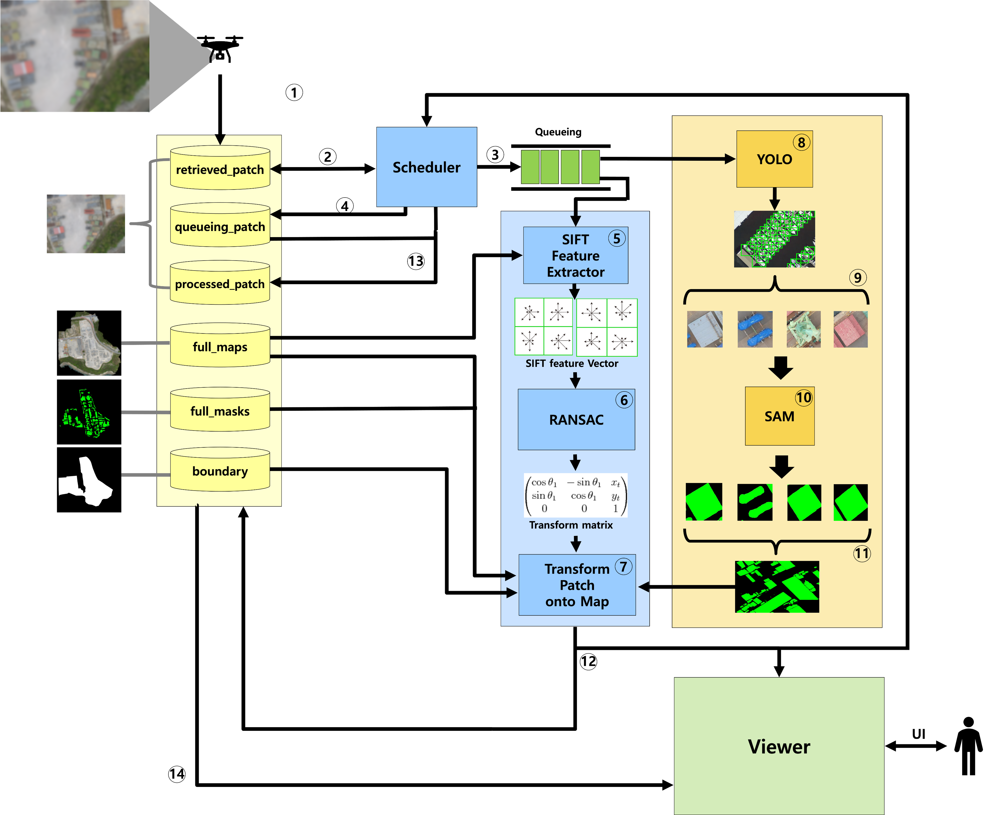
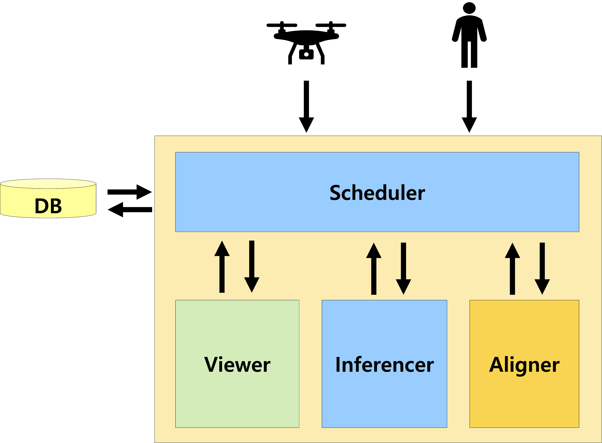
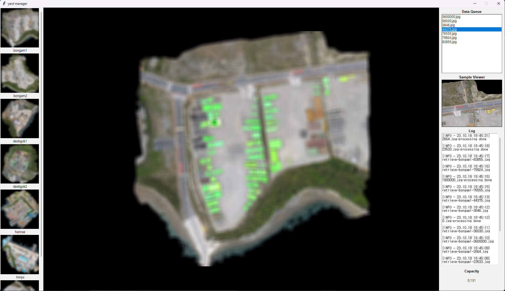

### 1. 프로젝트 소개
<br>

✔️ 규모가 매우 큰 야외 적치장(이하 야적장)에서는 사람의 눈으로 적재율이 어느 정도 되는지 알 수 없다.<br>

✔️ 적재된 물체를 Instance 별로 Segmentation하고, 적재율을 실시간으로 계산하는 시스템을 구현한다면, 물류 효율 증진을 위한 **'스마트 물류 시스템'** 을 구현할 수 있다.<br>

✔️ 따라서 우리는 실제 기업의 야적장 데이터를 이용해, 놓여진 다양한 물체들을 Detection 및 Segmentation 하는 Pipeline을 구축하고, 야적장 내 적재율을 실시간으로 계산하는 시스템을 제안한다.<br>


<br>

### 2. 팀 소개
<br>

✏️ Kim Kyung Hyun, klps44@naver.com, **데이터 전처리**, **Detection & Segmentation 알고리즘 설계**

✏️ Yu il hae, yih0826@pusan.ac.kr, **어플리케이션 제작 총괄 (BackEnd & FrontEnd)**

✏️ Shin Min Kun, zhdhfhd33@naver.com, **선행 연구 조사**, **Image Matching 알고리즘 설계**

<br><br>
### 3. 시스템 구성도

<br>

✅ 본 시스템의 특징은 다음과 같다.
- **YOLAM: YOLOv8 + Segment Anything** 모델을 통한 실시간 물류 적재율 계산 End-to-End Pipeline을 제안<br><br>
- 작업자가 쉽게 사용할 수 있는 **어플리케이션을 제작**해 물류 효율을 증진시킬 수 있는 스마트 물류 어플리케이션 제작<br><br>
- **'컴퓨터비전개론'** 에서 배운 SIFT 및 RANSAC을 적용해 Image Match 및 Alinment<br><br>
- **'운영체제'** 에서 배운 Critical Section - mutex를 적용한 Multi Thread 구현<br><br>

<br>

✅ 전체적인 파이프라인은 다음과 같다.<br><br>


1.	Drone을 이용해 야적장 내 이미지를 촬영함<br>
2.	촬영 된 이미지는 메인 컴퓨터로 저장되어 전체 View를 구성함<br>
3.	이와 동시에 단일 이미지는 사용자 프로그램으로 전송되어 YOLAM에 input으로 들어감<br>
4.	Output으로 나온 segmented mask 이미지를 SIFT + RANSAC 알고리즘을 거쳐 전체 view에 Image matching 수행<br>
5.	Matching된 이미지를 프로그램 화면에 출력<br>
6.	전체 야적장의 free-space 비율을 함께 출력<br><br>

<br>

✅ 작업자가 손쉽게 사용할 수 있도록 GUI를 구현했으며, 기능은 다음과 같다.<br><br>


1. Real-Time 야적장 viewer<br>
2. Drone에서 전송된 이미지 확인<br>
3. 현재 적재율 계산 및 출력<br>
4. 기능 개선 및 유지보수가 쉬운 OOP 구조<br><br>

   
<br>

✅ 전체 프로그램 UI는 다음과 같다.<br><br>


- 야적장 상태를 Real-Time으로 모니터링하고, 적재율을 계산한다.
- 작업자는 회사의 전체 야적장 list을 좌측에서 확인할 수 있다.
- 계산된 야적장의 적재율은 우측 아래에 Real-Time으로 계산되어 출력된다.
- Drone이 송출하는 데이터 및 Image Processing Log를 우측에서 확인할 수 있다.


<br><br>
### 4. 소개 및 시연 영상
<br>

**👇🏻 발표영상 보러가기** (이미지 클릭)<br>
[](https://www.youtube.com/watch?v=QM6eMy1locc)

<br><br>
### 5. 설치 및 사용법

<br>

✅ DIR 구조 <br>

```
./FlyToTheSky/
├── Inferencer.py
├── aligner.py
├── datas/
│   ├── boundary/          -> 전체 바운더리 영역을 표시하는 image
│   ├── full_maps/         -> 전체 view image
│   ├── full_masks/        
│   ├── processed_patch/   
│   ├── queue_patch/       
│   └── retrieved_patch/   -> 처리할 image가 저장되는 patch
├── demo.py
├── frames/                -> UI 관련
│   ├── LeftFrame.py
│   ├── MainFrame.py
│   ├── RightFrame.py
├── main.py                -> 프로그램 실행용 파일
├── model_weight/          -> sam_vit_h.pth 및 bsetDS.pt 파일 넣기
├── ret_temp/
└── widgets/
```

<br>

✅ How To Use <br><br>

본 프로젝트는 Window에서 개발되었으며 함께 포함된 다음의 스크립트를 수행하여 
관련 패키지들의 설치와 빌드를 수행할 수 있습니다.<br><br>

✅ Requirements <br><br>

✔️ OS: Window 11 <br>
✔️ GPU: >= 10GB <br>
✔️ RAM: >= 8GB <br>
✔️ Python_version: 3.8.17 <br>

✔️ (추가) 가상환경 생성을 위해 anaconda 설치 <br><br>

✅ Run UI <br><br>

**1. 위 요구 사양과 anaconda 설치 유무를 확인하고, 적절한 위치에 이 repository를 clone합니다. <br>**

<br>

**2. './FlyToTheSky' 디렉토리로 이동합니다. <br>**

```
$ cd ./FlyToTheSky
```

<br>

**3. 모델 weight 파일을 아래 링크에서 다운받아 './FlyToTheSky/model_weight/'에 넣습니다. <br>**

👉🏻 [sam_vit_h.pth](https://drive.google.com/file/d/1kHD2y0Bvon7lGwngKNc-AvWx4l9zSX4c/view?usp=sharing)<br>
👉🏻 [bestDS.pt](https://drive.google.com/file/d/13CTmXYHcu1wL1K5m6uoO2XWCZm9XJk3I/view?usp=sharing)

<br>

**4. conda 명령어를 사용해 가상환경을 생성하고, requirements.txt를 이용해 필요한 라이브러리들을 설치합니다. <br>**

```
$ conda --version

$ conda update conda

$ conda create -n FlyToTheSky python 3.8

$ conda activate FlyToTheSky

$ pip install -r requirements.txt
```

<br>

**5. 야적장 데이터들이 올바른 Dir에 들어있는지 확인하고, './FlyToTheSky/retrieved_patch/'에 처리하고자 하는 이미지를 넣습니다. <br><br>**


**6. main.py를 실행합니다. <br>**

```
$ python3 main.py
```


